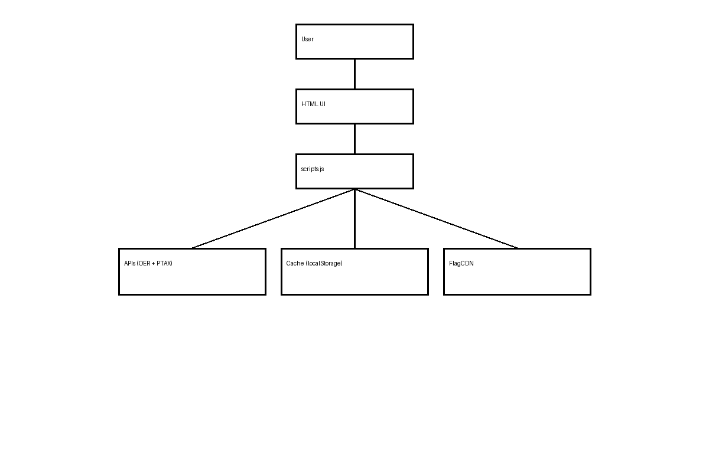

# 🌍 Currency Converter


A modern **Currency Converter web application** built with **HTML, CSS, and Vanilla JavaScript**.

It converts currencies in real time using external APIs and applies **client-side caching, offline fallback, locale-aware formatting, and internationalized currency names**.

When no `APP_ID` is configured, the app automatically runs in **Demo Mode** with simulated exchange rates so anyone can test the interface without extra setup.

This project was designed as a lightweight, production-style front-end application focused on **performance, resilience, and usability**.

---

## 🌐 Live Demo

Coming soon via **GitHub Pages**.

> The project already works without an API key thanks to **Demo Mode**.

---

## 🎬 Demo


---

## 🖼️ Architecture Overview



High-level flow:

User → HTML UI → `scripts.js` → APIs / Cache / Localization / Flags

Main integrations:
- **OpenExchangeRates API** for global exchange rates
- **Brazil Central Bank PTAX API** when BRL is involved
- **LocalStorage cache** for resilience and lower API usage
- **FlagCDN** for currency flags
- **Intl API** for localization and currency names

---

## ⭐ Why I Built This

Many currency converters rely heavily on live API requests and degrade quickly when network quality drops.

I built this project to demonstrate how a front-end application can remain useful under real-world constraints by combining:

- API request optimization
- local caching strategies
- offline fallback behavior
- locale-aware UX
- clean UI and practical accessibility improvements

---

## 🚀 Features

- Real-time currency conversion
- Automatic **Demo Mode** when no API key is configured
- Automatic currency detection based on browser locale
- Offline conversion using cached exchange rates
- Instant currency flag rendering
- Currency names displayed in the user's language
- BRL conversion using official **PTAX selling rate**
- Smart fallback system (**API → Cache → Offline**)
- Copy converted result to clipboard
- Input validation with inline status messages

---

## ⚡ Performance Strategy

| Strategy | Purpose |
|---|---|
| Local currency-country mapping | Instant flag rendering |
| Local JSON mapping | Removes unnecessary external flag lookups |
| Cached exchange rates | Reduces repeated API calls |
| Smart fallback system | Keeps the app usable when the network fails |
| Debounced input | Prevents excessive calculations while typing |

---

## 📦 APIs Used

### OpenExchangeRates
Provides global currency exchange rates.

Example request:

```text
https://openexchangerates.org/api/latest.json?app_id=YOUR_APP_ID
```

Base currency: **USD**

### Central Bank of Brazil – PTAX
Official exchange rate used when BRL is involved.

Used when:
- `BRL → other currency`
- `other currency → BRL`

Rate used:
- **PTAX Venda (Selling Rate)**

---

## 🏳️ Currency Flags

Flags are rendered using **FlagCDN**.

Example:

```text
https://flagcdn.com/w80/us.png
```

Currency-to-country mapping is stored locally in:

```text
assets/currency-to-country.json
```

This allows **instant flag loading without additional API requests**.

---

## 🌐 Internationalization

Currency names are automatically translated using `Intl.DisplayNames`, and numeric formatting follows the user's browser language.

Examples:
- `pt-BR → BRL`
- `en-US → USD`
- `en-GB → GBP`
- `fr-FR → EUR`

---

## 💾 Offline Support

Exchange rates are cached using `localStorage`.

| Data | Duration |
|---|---|
| OpenExchangeRates | 1 hour |
| PTAX | 24 hours |

Fallback logic:

```text
API → Cache → Offline mode
```

If live services are unavailable, the application attempts to keep working with the latest saved data.

---

## 🔎 Automatic Currency Detection

The application attempts to infer the user's local currency using:

1. `Intl.Locale().maximize()`
2. `navigator.language`
3. timezone heuristic fallback

---

## 📂 Project Structure

```text
currency-converter/
├── README.md
├── .gitignore
├── config.example.js
├── index.html
├── style.css
├── scripts.js
└── assets/
    ├── currency-to-country.json
    ├── flag-placeholder.svg
    ├── currency_converter_architecture.png
    └── currency_converter_demo.gif
```

---

## ⚙️ Setup

### 1. Clone the repository

```bash
git clone https://github.com/rpollaco-hit/currency-converter.git
```

### 2. Create an OpenExchangeRates account

Create an account and copy your `APP_ID`.

### 3. Optional: enable live exchange rates

The project runs in **Demo Mode** by default.

To use live rates, copy `config.example.js` to `config.js` and add your real key:

```javascript
window.APP_CONFIG = {
  OER_APP_ID: "YOUR_APP_ID"
};
```

`config.js` is ignored by Git, so your key stays local.

You can also override the key temporarily through the URL:

```text
index.html?apikey=YOUR_APP_ID
```

If you skip this step, the app will still work in **Demo Mode** using simulated exchange rates.

### 4. Run the project

Open the project with **VS Code Live Server** or any static local server.

Example:

```text
http://localhost:5500
```

---

## 🧩 Technologies

- HTML5
- CSS3
- Vanilla JavaScript
- OpenExchangeRates API
- Brazil Central Bank PTAX API
- FlagCDN
- Intl API
- LocalStorage

---

## Known Limitations

- Live exchange rates require a valid **OpenExchangeRates APP_ID**
- Demo Mode uses simulated exchange rates for portfolio and testing purposes
- Public front-end apps should not expose real production API keys
- `config.js` should stay local and should not be committed
- GitHub Pages deployment link is not included yet
- PWA installation is planned but not implemented yet

---

## 📈 Future Improvements

Possible future improvements:

- Historical exchange-rate charts
- Cryptocurrency conversion
- Progressive Web App (PWA)
- Dark mode
- Service Worker caching
- Exchange-rate alerts
- Desktop packaging with Electron
- Mobile packaging with Capacitor

---

## 👨‍💻 Author

**Anderson Marcondes Santana**  
Business Analyst • Technology Consultant • Full-Stack Learner

- GitHub: `https://github.com/rpollaco-hit`
- LinkedIn: `https://www.linkedin.com/in/andersonmarcondessantana/`

---

## 📜 License

MIT License

---

⭐ If you like this project, consider giving it a **star**.
