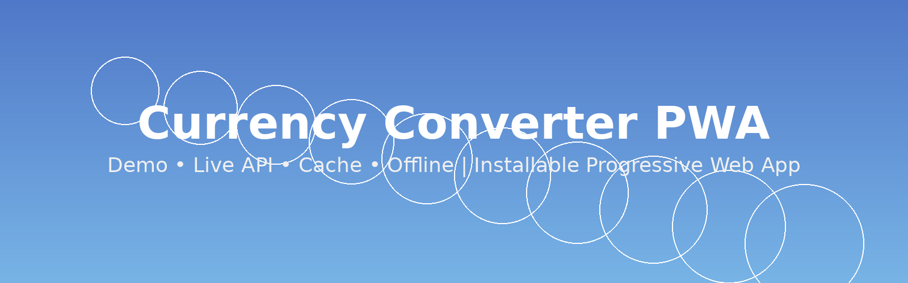

# 🌍 Currency Converter PWA

A lightweight **Currency Converter Progressive Web App (PWA)** built with **HTML, CSS and Vanilla JavaScript**.

The application converts currencies using **OpenExchangeRates**, while maintaining usability even when the network is unavailable through **local caching, offline fallback and demo mode**.

It was designed as a **portfolio-quality front-end project**, demonstrating modern client-side architecture principles such as:

- API integration
- resilient fallback strategies
- PWA capabilities
- localized user experience
- lightweight performance-first design

---

# 🌐 Live Application

**GitHub Pages**

https://rpollaco-hit.github.io/currency-converter/

The application works **even without an API key** thanks to the built-in **Demo Mode**.

---

# 🎬 Demo

---

# 🖼️ Architecture Overview

High-level flow:

User Interface → scripts.js → Execution Mode Detection → API / Cache / Offline / Demo

Core components:

- OpenExchangeRates API
- LocalStorage caching
- Service Worker caching
- Currency localization (Intl API)
- Local flag mapping

---

# ⭐ Project Goals

Many currency converters depend entirely on external APIs and stop working when the network fails.

This project demonstrates how a **front-end application can remain functional under real-world constraints** by combining:

- smart API usage
- local caching
- offline fallback
- progressive enhancement
- installable web app architecture

---

# 🚀 Features

## Core Features

- Real-time currency conversion
- Demo Mode when no API key is configured
- Automatic currency detection based on browser locale
- Offline conversion using cached exchange rates
- Currency names displayed in the user's language
- Automatic currency flags
- Copy converted result to clipboard
- Swap currencies instantly
- Input validation with status messages

## PWA Features

- Installable application
- Service Worker cache
- Offline capability
- Loading screen
- Responsive layout for mobile and desktop

## Execution Mode Detection

The application automatically detects which data source is being used.

Possible modes:

| Mode | Description |
|-----|-------------|
| Demo | Simulated exchange rates |
| API | Live rates from OpenExchangeRates |
| Cache | Cached rates from previous API calls |
| Offline Cache | Cached rates when offline |

This information is displayed in the **Rate Info panel**.

---

# ⚡ Performance Strategy

| Strategy | Purpose |
|---|---|
Local currency-country mapping | Instant flag rendering |
Local JSON mapping | Avoid external flag lookups |
Cached exchange rates | Reduce API calls |
Service Worker cache | Faster loading |
Debounced input | Prevent excessive recalculations |

---

# 📦 API Used

### OpenExchangeRates

Provides global currency exchange rates.

Example request:

https://openexchangerates.org/api/latest.json?app_id=YOUR_APP_ID

Base currency: **USD**

The application automatically converts between all supported currencies.

---

# 🏳️ Currency Flags

Flags are loaded using **FlagCDN**.

Example:

https://flagcdn.com/w80/us.png

Currency-to-country mapping is stored locally in:

assets/currency-to-country.json

This allows **instant rendering without additional API calls**.

---

# 🌐 Internationalization

Currency names and formatting are automatically localized using:

- Intl.DisplayNames
- Intl.NumberFormat

Examples:

| Locale | Currency |
|------|------|
pt-BR | BRL |
en-US | USD |
en-GB | GBP |
fr-FR | EUR |

---

# 💾 Offline Support

Exchange rates are cached using **LocalStorage**.

| Data | Cache Duration |
|----|----|
OpenExchangeRates | 1 hour |

Fallback logic:

Live API → Local Cache → Offline Cache → Demo Mode

This ensures the application continues functioning even during connectivity issues.

---

# 🔎 Automatic Currency Detection

The application attempts to infer the user's currency using:

1. Intl.Locale().maximize()
2. navigator.language
3. timezone heuristic fallback

---

# 📂 Project Structure

currency-converter/
│
├── README.md
├── LICENSE
├── .gitignore
├── config.example.js
│
├── index.html
├── style.css
├── scripts.js
├── service-worker.js
├── manifest.json
│
└── assets/
    ├── currency-to-country.json
    ├── flag-placeholder.svg
    ├── currency_converter_demo.gif
    ├── currency_converter_architecture.png

---

# ⚙️ Setup

### Clone the repository

git clone https://github.com/rpollaco-hit/currency-converter.git

### Create an OpenExchangeRates account

https://openexchangerates.org

### Enable live exchange rates (optional)

Copy:

config.example.js

to:

config.js

Then add your key:

window.APP_CONFIG = {
  OER_APP_ID: "YOUR_APP_ID"
};

config.js is ignored by Git so your key remains local.

### Run locally

http://localhost:5500

---

# 🧩 Technologies

- HTML5
- CSS3
- Vanilla JavaScript
- OpenExchangeRates API
- Service Worker
- Web App Manifest
- LocalStorage
- Intl API
- FlagCDN

---

# Known Limitations

- Live rates require a valid OpenExchangeRates APP_ID
- Demo Mode uses simulated rates
- Public front-end apps should not expose production API keys
- config.js should remain local
- Exchange rates depend on API availability

---

# 📈 Future Improvements

Possible improvements:

- Historical exchange rate charts
- Cryptocurrency conversion
- Dark mode
- Exchange-rate alerts
- Favorite currencies
- Travel currency planner
- Mobile packaging with Capacitor

---

# 👨‍💻 Author

Anderson Marcondes Santana

Business Analyst • Technology Consultant • Full-Stack Learner

GitHub  
https://github.com/rpollaco-hit

LinkedIn  
https://www.linkedin.com/in/andersonmarcondessantana/

---

# 📜 License

MIT License

---

⭐ If you like this project, consider giving it a star.
